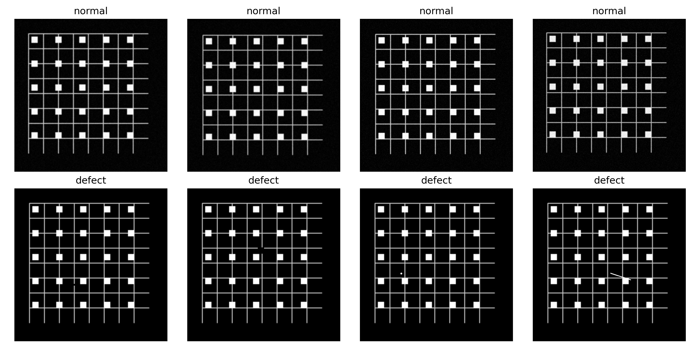
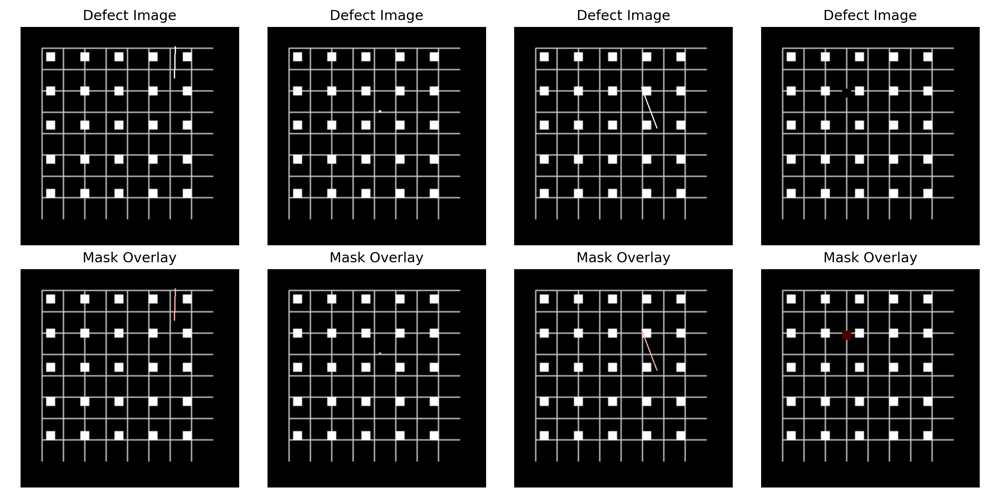
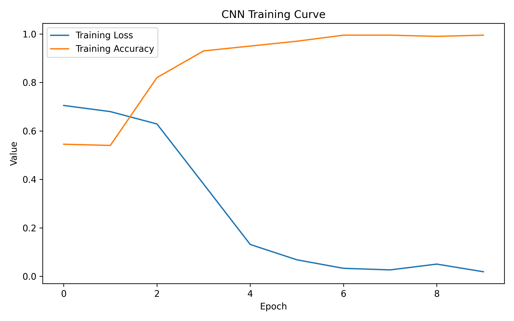
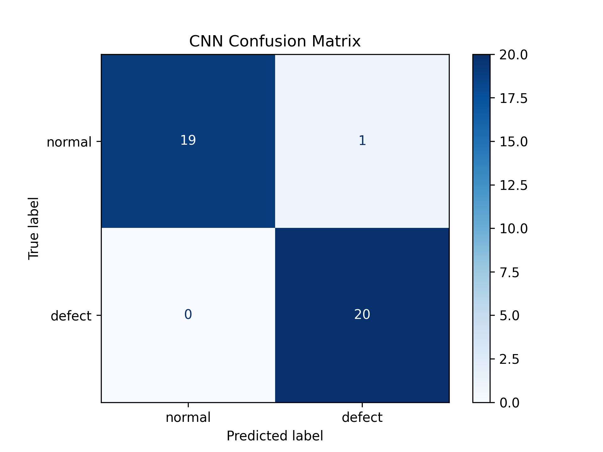
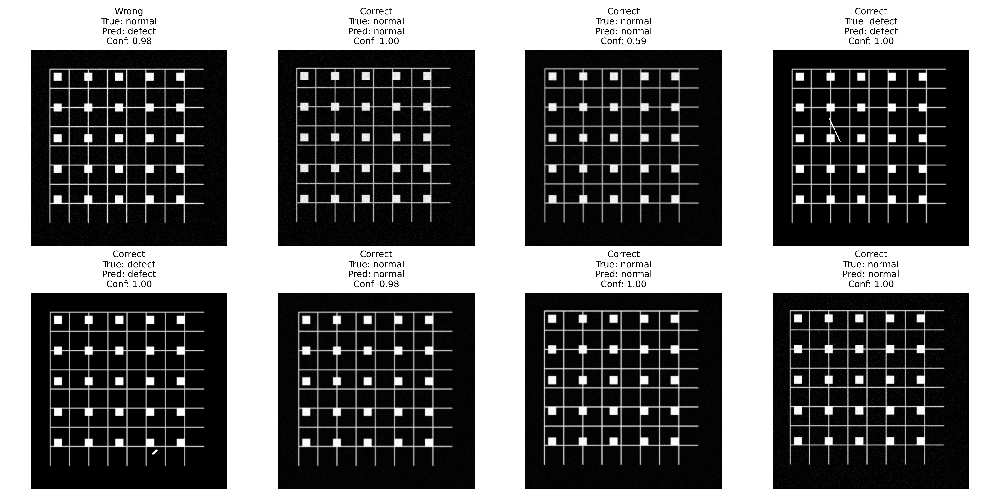
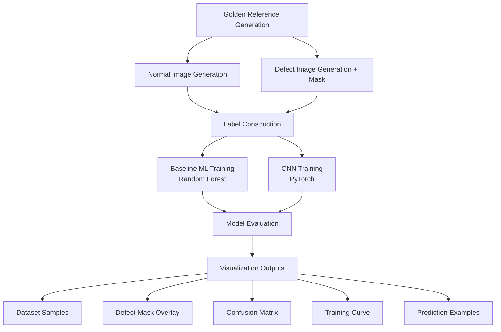

# Synthetic Semiconductor AOI Defect Detection  
**Python / OpenCV / PyTorch / Scikit-learn**

模組化的機器學習流程，利用合成資料產生和深度學習來模擬半導體AOI（自動光學檢測）。

A modular machine learning pipeline that simulates semiconductor AOI (Automated Optical Inspection) using synthetic data generation and deep learning.

本專案以 Python 為核心，模擬半導體 AOI（Automated Optical Inspection）檢測流程，透過合成影像資料（synthetic dataset）建立完整的 Machine Learning pipeline，包含資料生成、缺陷模擬、模型訓練與視覺化分析。

---

# Project Overview（專案概述）

本專案模擬半導體 AOI 缺陷檢測流程，從 **資料生成 → 模型訓練 → 視覺化分析** 建立完整 pipeline。

核心目標：

- 模擬 AOI 檢測流程（無真實資料情況）
- 建立 synthetic dataset
- 訓練 ML + CNN 模型
- 提供可解釋的視覺化分析

---

# System Architecture

Golden Reference
↓
Normal Data Generation
↓
Defect Simulation + Mask
↓
Label Construction
↓
Baseline ML (Random Forest)
↓
CNN (PyTorch)
↓
Evaluation + Visualization

---

# AOI Background（AOI 背景）

AOI（Automated Optical Inspection）常用於半導體製程中，用來檢測：

- 刮痕（scratch）
- 顆粒污染（particle）
- 線路斷裂（open circuit）
- 線路短路（bridge）
- 元件缺失（missing pattern）
- 污漬（stain）

In real-world semiconductor manufacturing, AOI systems detect defects that may impact yield and device functionality.

---

# Dataset Generation（資料生成）

本專案完全使用 Python 合成資料（無需外部 dataset）

## ✔ Golden Reference
- 模擬晶片線路與 pads
- 作為所有資料的基底

## ✔ Normal Images
- Brightness variation
- Noise injection
- Blur & spatial shift

## ✔ Defect Images
隨機生成 6 種 AOI 常見缺陷：

| Defect Type | Description |
|---|---|
| Scratch | 表面刮痕 |
| Particle | 顆粒污染 |
| Open Circuit | 線路斷裂 |
| Bridge | 線路短路 |
| Missing Pad | 元件缺失 |
| Stain | 局部污染 |

同時產生：
- defect image
- pixel-level mask（可擴展 segmentation）

---

# Models

## 🔹 Baseline Model
- Random Forest (Scikit-learn)
- 使用手工特徵（intensity, edges）

## 🔹 CNN Model
- PyTorch implementation
- 自動學習影像特徵（edge / texture / defect pattern）

---

# Dataset Visualization（資料視覺化）

## Sample Dataset



## Defect Mask Overlay



---

# Machine Learning Models

## 1️⃣ Baseline Model（Random Forest）

- 使用手工特徵（亮度、邊緣等）
- 建立基本分類能力

## 2️⃣ CNN Model（PyTorch）

- 直接從影像學習特徵
- 模擬真實 AOI 系統

---

# 📊 Results

## ✔ Performance

- Accuracy: **95%**
- Defect Recall: **100%**
- False Negative: **0**

在 AOI 中，**避免漏檢 defect 是關鍵指標**

---

## Training Curve



---

## Confusion Matrix



---

## Prediction Examples



- 顯示 Correct / Wrong cases
- 包含 confidence score
- 分析模型錯誤模式

---

## Defect Overlay


---

# How to Run

## 1️⃣ Install dependencies

```bash
pip install -r requirements.txt
```

## 2️⃣ Generate dataset

```bash
python -m src.data.generate_reference
python -m src.data.generate_normal
python -m src.data.generate_defect
python -m src.data.create_labels
```

## 3️⃣ Train models

```bash
python -m src.training.train_baseline
python -m src.training.train_cnn
```

## 4️⃣ Visualization

```bash
python -m src.visualization.visualize_dataset
python -m src.visualization.visualize_defect_overlay
python -m src.visualization.visualize_predictions
```

---

# 📂 Project Structure

```text
learnig_semi_aoi_with_ml/
│
├── data/
│   ├── raw/
│   │   └── golden_reference.png
│   │
│   ├── train/
│   │   ├── normal/
│   │   └── defect/
│   │
│   ├── test/
│   │   ├── normal/
│   │   └── defect/
│   │
│   ├── masks/
│   └── labels.csv
│
├── outputs/
│   ├── figures/
│   │   ├── sample_dataset.png
│   │   ├── defect_overlay.png
│   │   ├── baseline_confusion_matrix.png
│   │   ├── cnn_confusion_matrix.png
│   │   ├── cnn_training_curve.png
│   │   └── cnn_prediction_examples.png
│   │
│   └── models/
│       ├── baseline_random_forest.joblib
│       └── cnn_aoi_model.pth
│
├── src/
│   ├── __init__.py
│   ├── config.py
│   ├── paths.py
│   │
│   ├── data/
│   │   ├── aoi_dataset.py
│   │   ├── create_labels.py
│   │   ├── generate_defect.py
│   │   ├── generate_normal.py
│   │   └── generate_reference.py
│   │
│   ├── models/
│   │   ├── baseline.py
│   │   └── cnn.py
│   │
│   ├── training/
│   │   ├── train_baseline.py
│   │   └── train_cnn.py
│   │
│   ├── visualization/
│   │   ├── visualize_dataset.py
│   │   ├── visualize_defect_overlay.py
│   │   └── visualize_predictions.py
│   │
│   └── utils/
│       └── image_utils.py
│
├── README.md
├── requirements.txt
└── .gitignore
```

本專案採用模組化架構。  
`src/data` 負責合成 AOI 資料生成，`src/models` 定義 ML 與 CNN 模型，`src/training` 負責模型訓練與評估，`src/visualization` 則產生分析與展示用圖表。

---

## 🏗️ System Architecture



---

# Engineering Highlights

- Modular ML pipeline (data / model / training / visualization separation)
- Config-driven design (centralized hyperparameters)
- Reproducible dataset generation (fixed random seed)
- Scalable architecture for future extension (multi-class / detection / segmentation)
- End-to-end pipeline without external dataset

---

# Future Work

- Multi-class defect classification
- Defect localization (bounding box / segmentation)
- Hard-case dataset generation (low contrast defects)
- Integration with real AOI dataset
- Web demo (Streamlit / Django)

---

# Learning Notes

本專案為自學實作：

- 從零建立 Machine Learning pipeline
- 深入理解 AOI 檢測邏輯
- 使用 PyTorch 建立 CNN 模型
- 透過 ChatGPT 輔助學習與設計架構

This project was developed as a self-learning project with conceptual guidance from ChatGPT.

---

# Author

Derick Liu

- Background: Art&Design + TechArt
- Interest: Machine Learning, Computer Vision, Semiconductor AI Applications